# Sh4dow's Window Manager Installer (SWM)

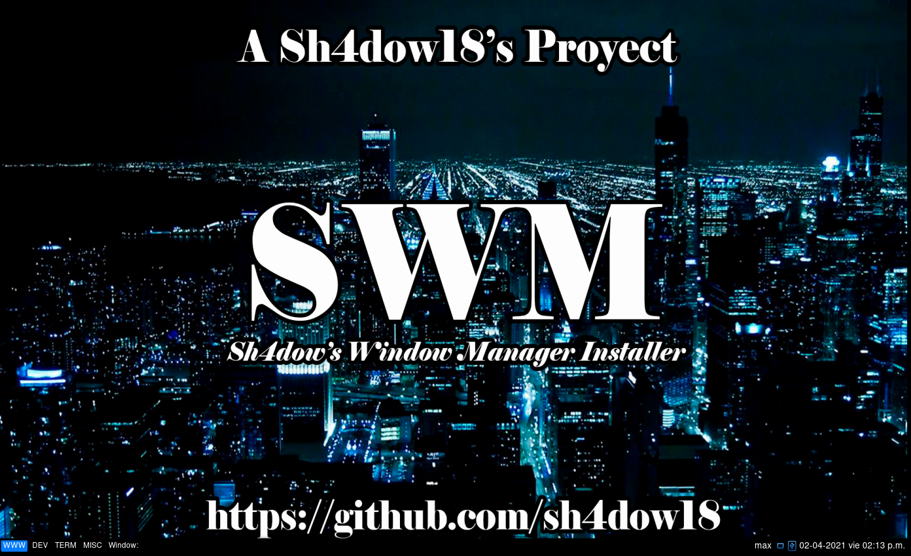

# Version

Version: **1.0 Beta 1**

# Overview

This guide teaches how to perform a clean install of Arch Linux, as well as
how to use the "Sh4dow's Window Manager Installer"(SWM) which will be used
to install window managers with custom settings, plus various additional
programs that will complement and enhance the desktop environment for the
user.

I will assume that you are comfortable with Linux based operating systems
and command line interfaces.

If you have a previous Arch Linux installation, I recommend you to backup
your files and reinstall Arch Linux. This because, can be problems if it
not is a clean installation.

# What is a Window Manager?

The window manager is the program that aims to allow the user to manage the
size of the application windows on the screen.

Tile window managers only focus on arranging the windows on the screen by
making sure of two things:

	- Each window will use all available space on the screen

	- If several windows are opened, they will all be displayed at the
	  same time according to certain rules (layouts).

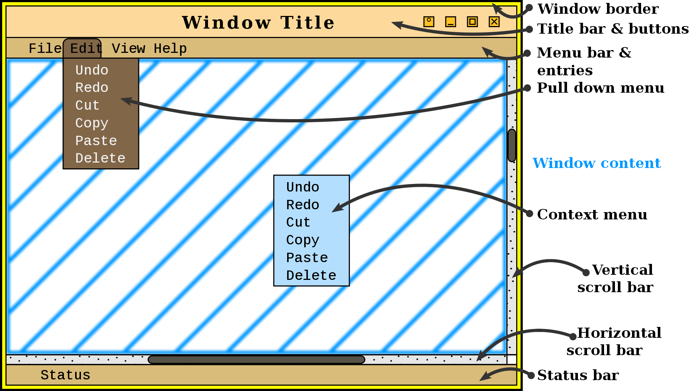

If you want to know more about this, you can visit 
**[this site](https://binary-coffee.dev/post/acerca-de-los-manejadores-de-ventanas-de-mosaico-tiling)**
for more information

# Warning!


This installation will need at least of **3.5 GB** in your hard disk drive,
**1.5 GB** for "Arch Linux" and the other **2 GB** for the window managers
and their settings.

# Arch Linux Installation


Arch Linux should run on any "x86_64"-compatible machine with a minimum of
"512 MB" in "RAM". A basic installation should take less than "2 GB" of disk
space. As the installation process needs to retrieve packages from a remote
repository, this guide assumes a working internet connection is available.

First at all, you need to download the ".iso" that you can find here:
**[Arch Linux ISO Download](https://archlinux.org/download/)**

Now, read the
**[Arch Linux Installion Guide](https://wiki.archlinux.org/index.php/Installation_guide)**
, but not reboot your system, because the installation guide do not tell
you what you have to do after you install the necesarry things to boot Arch.

First, you will need to install the package "Network Manager":

```bash
pacman -S networkmanager
systemctl enable NetworkManager
```

This package, as its name suggests, it is a manager to the network that can
allow you to connect to the Internet.

Also, you need the package "grub". If you have a system with "dos" you will
do:

```bash
pacman -S grub
grub-install /dev/sda
grub-mkconfig -o /boot/grub/grub.cfg
```

If you have a system with "UEFI" you will do:

```bash
pacman -S grub efibootmgr os-prober
grub-install --target=x86_64-efi --efi-directory=/boot
os-prober
grub-mkconfig -o /boot/grub/grub.cfg
```

Now, you will install the package "sudo":

```bash
pacman -S sudo
```

Edit **/etc/sudoers** with **nano** by uncommenting this line:

```bash
## Uncomment to allow members of group wheel to execute any command
# %wheel ALL=(ALL) ALL     <--- This Line
```

That allow to all the users in the "wheel" group to use administrator
permission for a command that need it. For Example:

```bash
sudo pacman -R nano
```

Later, you can create a new user ("username" refers to the name of the
user you are creating. You should not put the "<>"):

```bash
useradd -m <username>
passwd <username>
usermod -aG wheel,audio,video,storage <username>
```

Now the user is created and can use the command "sudo" without problems.
Also, the user can use audio, can see videos and can save files.

Finally, you must exit the root in "/mnt", unmount "/mnt" recursively
and reboot your system.

```bash
exit
umount -R /mnt
reboot
```

If you have a Laptop, All-in-One Computer or you use wireless connection,
after reboot and enter in your system, you will put("device" refers to the
wireless interface that you have. Normally is "wlan0". You should not put
the "<>"):

```bash
nmcli <device> wifi list
```

This will show you a list of access points in your area.

If you do not have the "wlan0" interface, you can check what interface
you have with the next command:

```bash
ip link
``` 

This command show you the interfaces that you have in your system.

To access to an access point put ("SSID" refers to a name of the access
point. "password" refers to the password of the access point. You should not
put the "<>"):

```bash
nmcli <device> wifi connect <SSID> password <password>
```

If you want to know, the command "nmcli" means "Network Manager Command Line
Interface", that you install when did you install the package "Network
Manager".

# Using SWM


To use the "Sh4dow's Window Manager Installer" you need the program "git", that
you can install with **pacman**:

```bash
sudo pacman -S git
```

Later, you will clone this repository:

```bash
git clone https://github.com/sh4dow18/swm.git
```

Now, go to "swm" folder:

```bash
cd swm/
```

Finally, to execute the installer, put:

```bash
sudo bash installer.sh
```

## SWM Information

**Sh4dow's Window Manager Installer** introduces himself first:

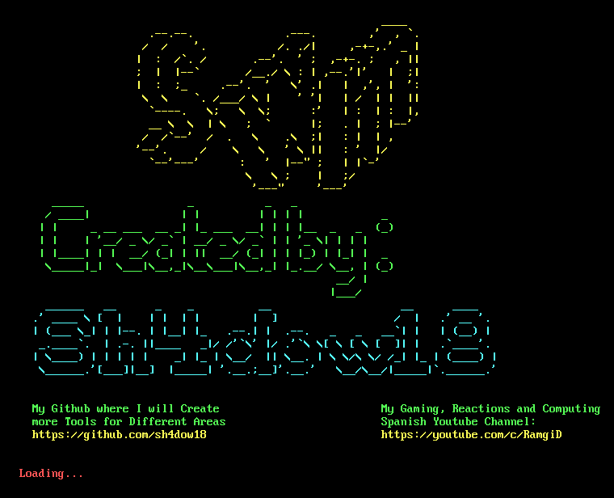

Now, the program needs to verificate if a user exists to install the configuration
files. The user's can not be any pre installed user, because, many of the
configuration files needs to install in a user's home:

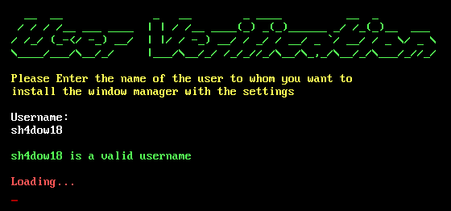

Later, the program needs to have more details about your system that can not know,
like if you are in a PC with HDMI connection on your monitor, or if you have an
intergrate screen or if you are in a virtual machine. This is necesary, because,
the program will configurate the screen in base to the screen that you have:

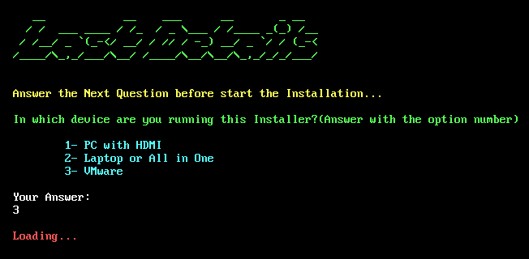

After that, the installation begins with the installation of system updates. This
is because it is best if the system is updated to obtain the best performance from
the programs that would be installed later:

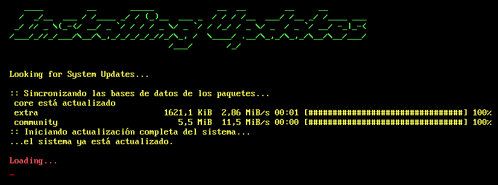

Followed, will be install the programs about window manager and extras for that one.
You have to press "Enter" key, to access to all the packages that will install.

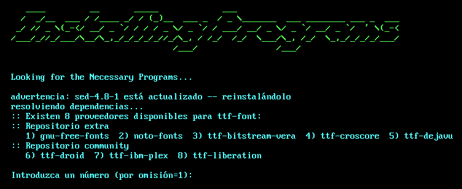

Now, press "s" and "Enter" key to download and install all the necesary packages:

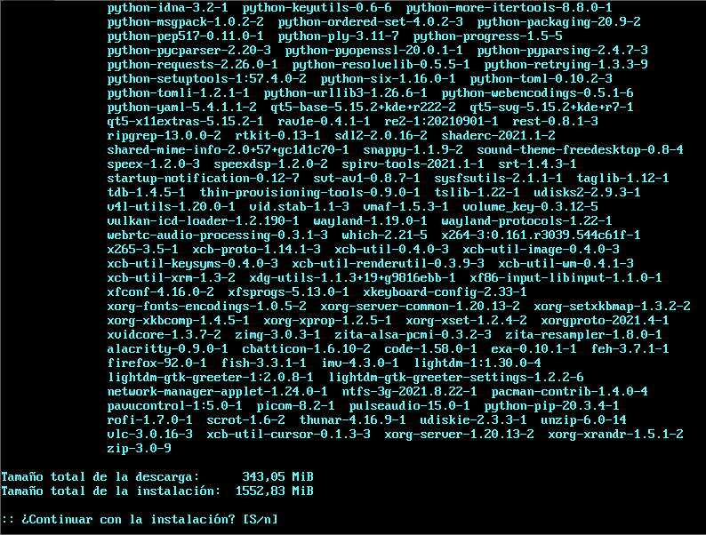

After, the installer automatically will install all the configuration that was
created previously:

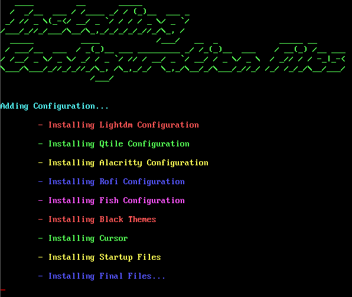

Later, the installer, if this hasn't errors, tell you that the installation was
finished and if you want to reboot now, because, the system need it for apply
changes:

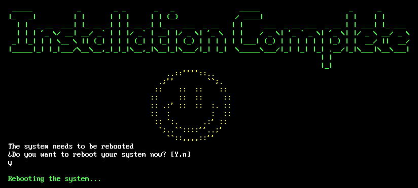

When you reboot your system, you will see the next window, obviously without the
arrows.

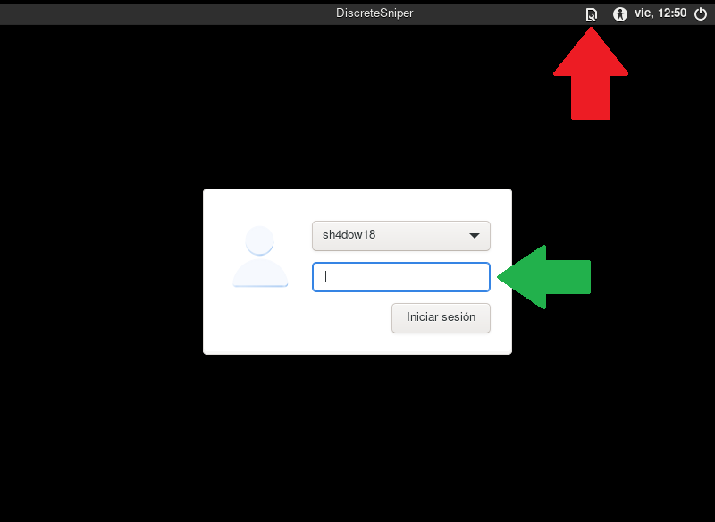

The green arrow points to the space you will put your user's password and the red
arrow points to the space that you can touch and the program will show you a mini
menu where you have the window managers installed that you can select.

And tada! You have now a window manager pre configured that you can use freely.
This is "Qtile", a window manager that has a filosofy that use many part of time
the key bindigs. It is a "advance" window manager:


If you want a window manager similar to "Windows", you have "Openbox", which was
configured so that it does not use key bindings and uses traditional floating
windows.


If you want to know how is the window management of both windows managers here are
two examples:

**Qtile**

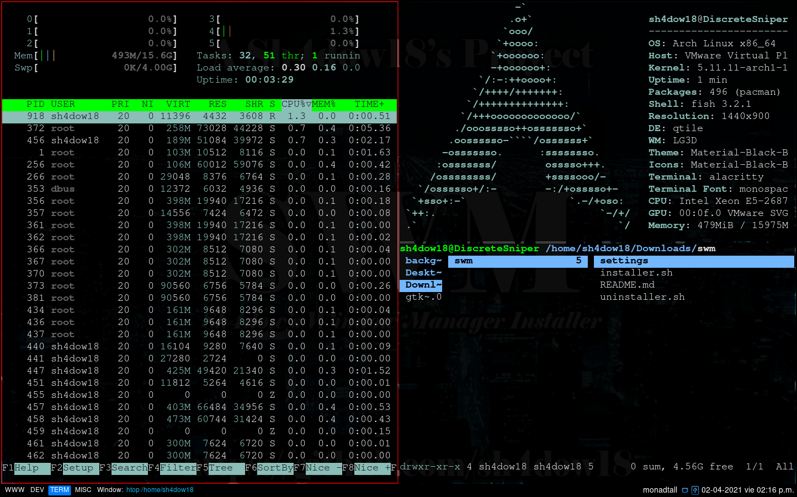

**Openbox**

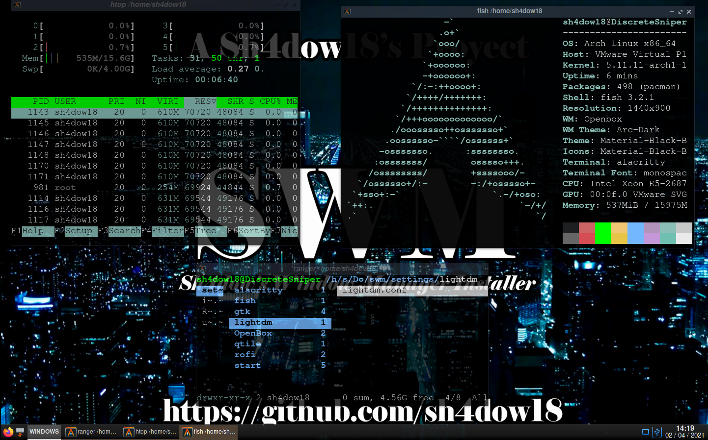

# Do you want to know more? Read THIS :D

Here, the software that was used in the installer will be shown in more depth. Also,
the key bindings that are pre configured in window managers and installed themes
will be shown.

## Software

| Package                      | Description                                 |
| ---------------------------- | ------------------------------------------- |
| lightdm                      | Login Manager                               |
| lightdm-gtk-greeter          | **Lightdm** User Interface                  |
| lightdm-gtk-greeter-settings | Settings for the **Lightdm** User Interface |
| xorg-server                  | Graphic Controller                          |
| qtile                        | Window Manager configured in *Python*       |
| openbox                      | Window Manager configured in *XML*          |
| alacritty                    | Terminal Emulator                           |
| rofi                         | Program Launcher                            |
| sed                          | Text parser and transformer                 |
| which                        | Executable File Finder                      |
| feh                          | Wallpaper Changer                           |
| firefox                      | Browser                                     |
| code                         | Code Text Editor                            |
| picom                        | Compositor for **Xorg**                     |
| gimp                         | Image Editor                                |
| udiskie                      | Automounter of Removable Media              |
| ntfs-3g                      | Stable NTFS Driver                          |
| xorg-xrandr                  | Monitor Resolution Configurator             |
| vlc                          | Video Visualizer and Audio Player           |
| imv                          | Image Visualizer                            |
| scrot                        | Screen Capturing Application                |
| thunar                       | GUI File Manager                            |
| zip                          | Files Compressor                            |
| unzip                        | Files Decompressor                          |
| xcb-util-cursor              | XCB Cursor Library                          |
| pacman-contrib               | Program that has scripts for **pacman**     |
| tint2                        | Tool Bar                                    |
| obconf                       | Theme Changer for Openbox                   |
| exa                          | Modern Replacement for **ls**               |
| fish                         | Smart and user-friendly command line shell  |
| gtkmm                        | Official C++ interface for GTK              |
| open-vm-tools                | Set of services and modules for VMware      |
| xf86-video-vmware            | VMware Video Driver                         |
| xf86-input-vmmouse           | VMware Mouse Driver                         |
| lxappearance                 | GUI Theme Changer                           |
| arandr                       | GUI Monitor Resolution Changer              |
| nitrogen                     | GUI Wallpaper Changer                       |
| network-manager-applet       | **Network Manager** Systray                 |
| pulseaudio                   | Sound Server                                |
| volumeicon                   | Volume Control in Systray                   |
| pavucontrol                  | GUI Sound Server                            |
| cbatticon                    | Battery Icon for Systray                    |

## Themes

| Theme          | Description             |
| -------------- | ----------------------- |
| Meterial Black | Black Theme for Qtile   |
| Arc Dark       | Black Theme for Openbox |

## Key Bindings

### Qtile

| Key Binding     | Action                            |
| --------------- | --------------------------------- |
| Mod + h         | Move Window Focus to Left         |
| Mod + l         | Move Window Focus to Right        |
| Mod + j         | Move Window Focus to Down         |
| Mod + k         | Move Window Focus to Up           |
| Mod + Space     | Move Window Focus to Other Window |
| Mod + Shift + h | Move Window to Left               |
| Mod + Shift + l | Move Window to Right              |
| Mod + Shift + j | Move Window to Down               |
| Mod + Shift + k | Move Window to Up                 |
| Mod + Enter     | Launch Alacritty                  |
| Mod + Tab       | Change Layout                     |
| Mod + w         | Kill Focused Window               |
| Mod + Ctrl + r  | Restart Qtile                     |
| Mod + Ctrl + q  | Quit Qtile                        |
| Mod + z         | Launch Rofi Menu                  |
| Mod + f         | Launch Firefox                    |
| Mod + c         | Launch Visual Studio Code         |
| Mod + g         | Launch Gimp                       |
| Mod + s         | Make a Screenshot                 |
| Mod + t         | Launch Thunar                     |

### Openbox

| Key Binding  | Action           |
| ------------ | ---------------- |
| Mod + Enter  | Launch Alacritty |

**OpenBox** has much less key bindings than **Qtile**, because,
**Openbox** for this installer was configured to be similar to
how a normal user use "Windows".

Here ends the documentation for now. Have a Nice Day :D